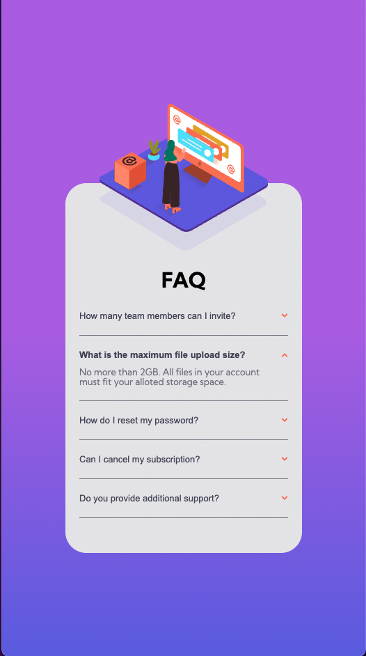
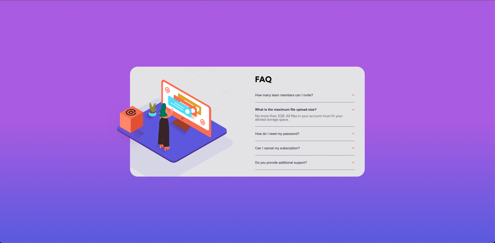

# NFT Preview Card Component
Esta es una solución de [NFT preview card component challenge on Frontend Mentor](https://www.frontendmentor.io/solutions/nft-preview-card-K9kE-s6NL0). 

## Tabla de contenidos

- [Resumen](#resumen)
    - [Desafio](#desafio)
    - [Screenshots](#screenshots)
    - [Links](#links)
- [Proceso](#proceso)
    - [Hecho con](#hecho-con)
    - [Lo que aprendí](#lo-que-aprendí)

## Resumen

### Desafío

Los usuarios deben ser capaces de:

- Visualizar adecuadamente el diseño, sin importar el tamaño de su pantalla.
- Ver los elementos interactivos de la página.

### Screenshots

La vista móvil queda de a siguiente manera:

Mientras que si el usuario usa una tableta o computadora, la vista se amplía:

### Links

- Solución en Frontend Mentor: [Frontend Mentor](https://www.frontendmentor.io/solutions/faq-accordion-card-gKDPBeFh2V)
- Live Site: [GitHub Pages](https://diegoesdev.github.io/FAQ-accordion-card/)

## Proceso

### Hecho con

- HTML5
- CSS3
- JavaScript
- Flexbox
- CSS Grid
- Mobile first 

### Lo que aprendí

Con este desafío aprendí a posicionar una imagen que sale del flujo normal del documento pueda mantenerse anidada al contenedor padre al que pertenece. También usando JavaScript, aprendí a ocultar diferentes elementos del documento cuando otros son seleccionados y finalmente a desplegarlos mediante un click.

> No pares de aprender.